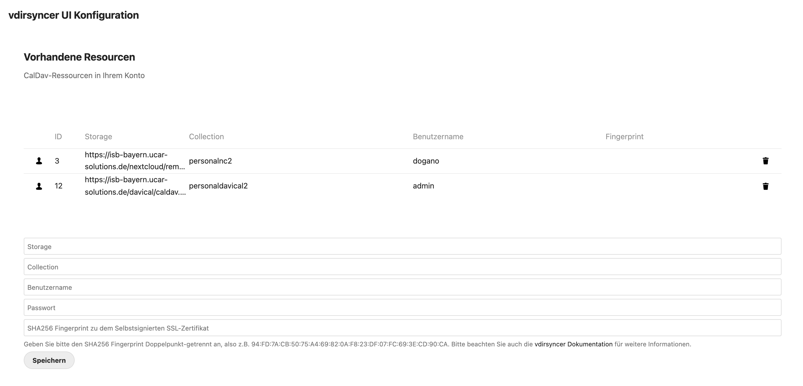
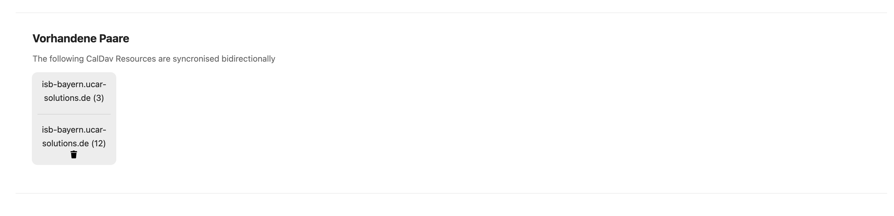
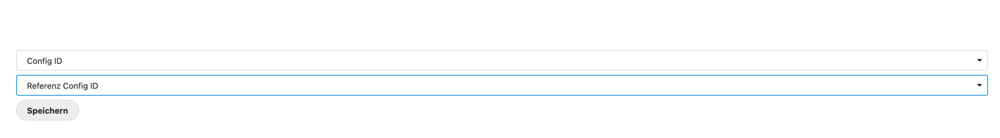

vdirsyncer UI
=====

.. autosummary::
   :toctree: generated

   vdirsyncerui

The vdirsyncer UI configuration is located at the personal settings for each user. vdirsyncer UI is splitted up into three main parts:
the resources part, the existing pairs part and the part where you can pair resources. Each of them are going to be explained in detail below

Resources
----------------

Resources consist of several information that are required to input by the user. With respect to the `vdirsyncer terminology <https://vdirsyncer.pimutils.org/en/stable/tutorial.html#configuration>`_,
storages are defined as the url to a principal on a CalDav server, collections are the calendar object on the server, username and password are self explanatory and the
input for SHA256 fingerprint - which is optional - can be used to verify SHA1-, SHA256- or MD5-Fingerprints (as described `here <https://vdirsyncer.pimutils.org/en/stable/ssl-tutorial.html#pinning-by-fingerprint>`_).

The storage has to be a valid url and - ideally - a valid CalDav server. The collection field has not to be empty and - again, ideally - an existing collection on the storage.
The username and password are also required fields since vdirsyncer UI does not expect that storages and/or collections are public. The fingerprint input is optional. You can
input the fingerprint of your SSL certificate and vdirsyncer UI will configure the underlying vdirsyncer config as follows:

#. setting verify to false
#. setting verify_fingerprint

Please refer to the vdirsyncer manual for further information.

Existing Pairs
----------------

"Existing pairs" is a simple list of resources paired with each other. In the "pairing" part (see below), you can pair resources you configured in "resources".
When pairing two resources, there are a couple of steps done:

#. a vdirsyncer config is created
#. a "pair" entry is stored into the database to
#. run a Nextcloud cron periodically

Pairing
----------------

Pairing lists all resources configured in 'resources'.